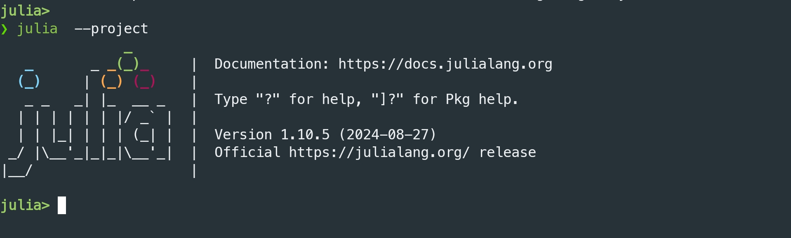

Pour installer julia sous linux suivre la procedure ci-apres :
```bash
curl -fsSL https://install.julialang.org | sh 
```

Sous windows, lancer le cmd et taper la commande ci-dessous :
```cmd
winget install julia -s msstore
```
Verifier votre installation en tapant dans le terminal
```
juliaup status 
```

En principe ça devera afficher la version de julia installé sur votre machine.

+ **Installation de la version lts (long-time support)**
```
juliaup add lts
```

+ **Lancement du REPL de Julia LTS**
```
julia +lts --project
```

